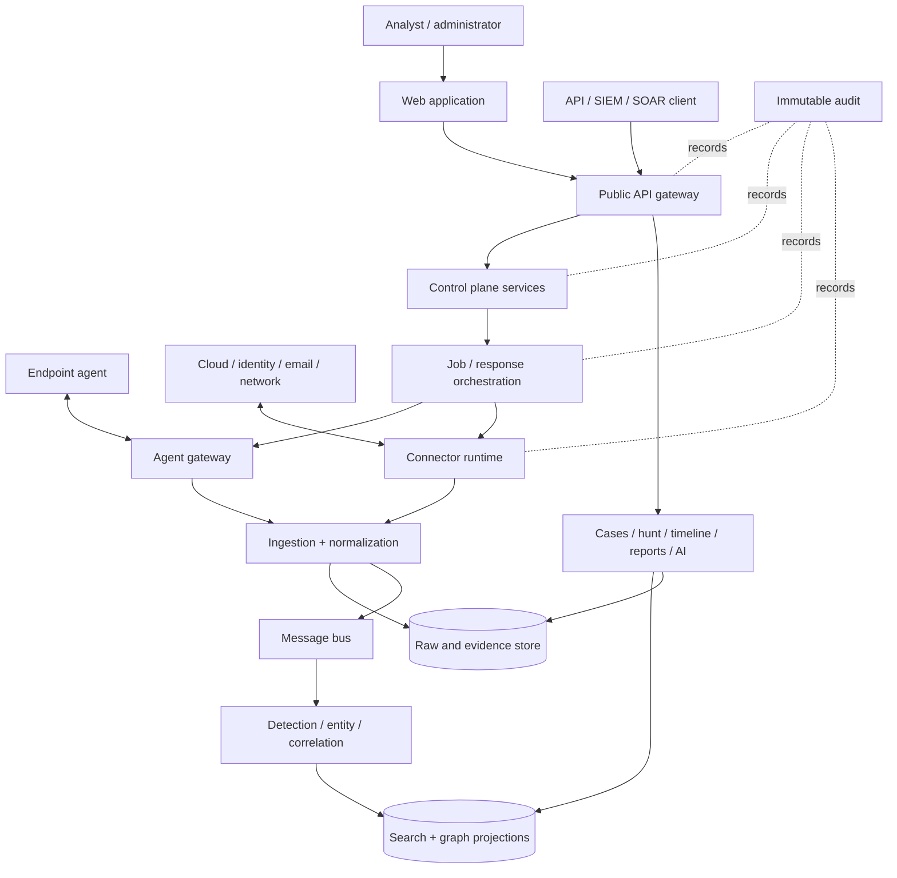
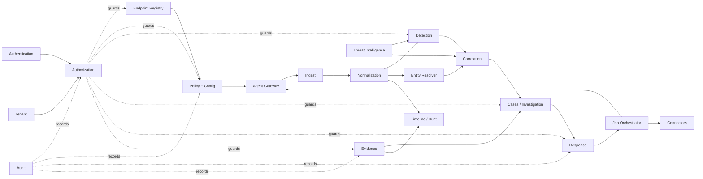
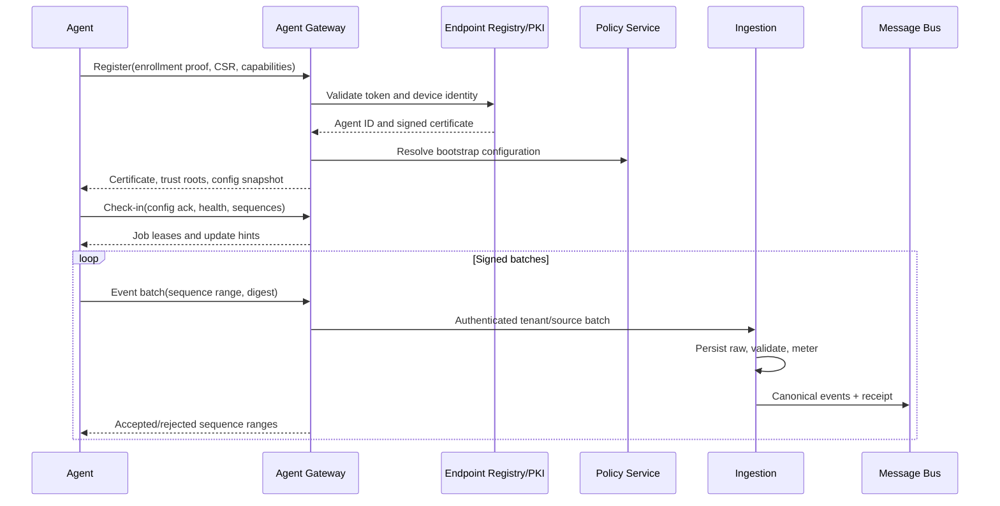
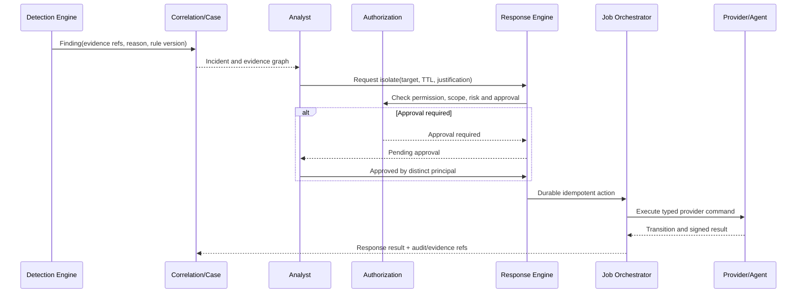
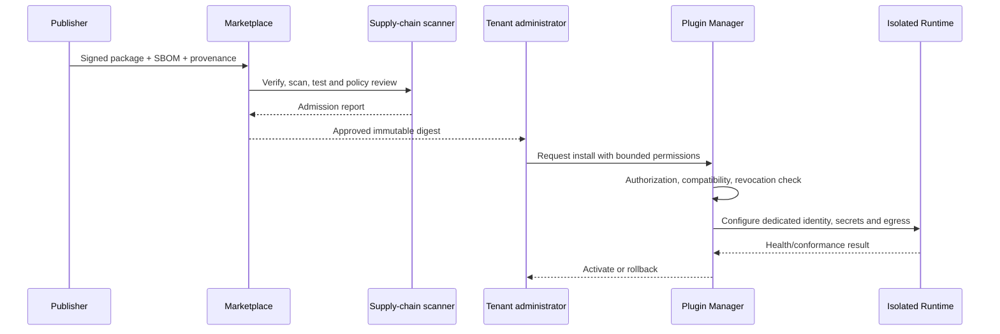
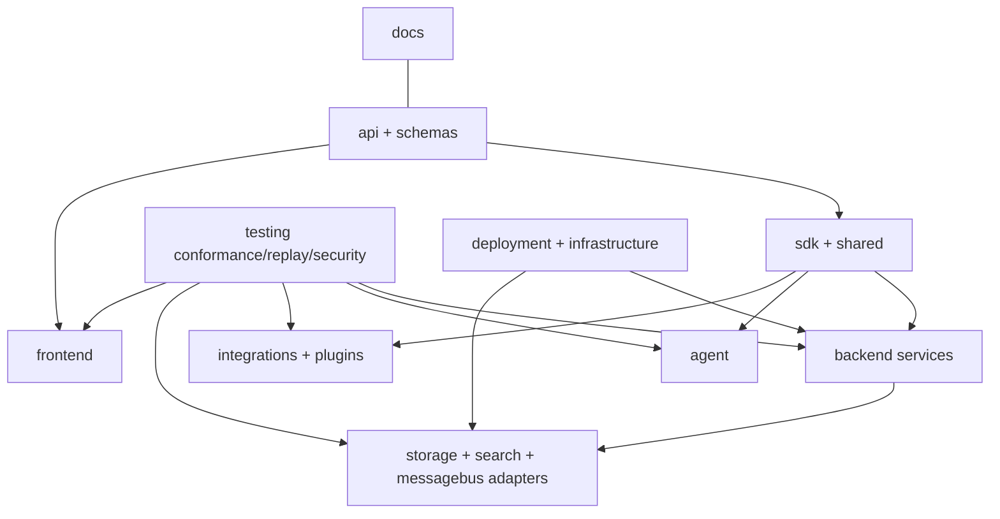
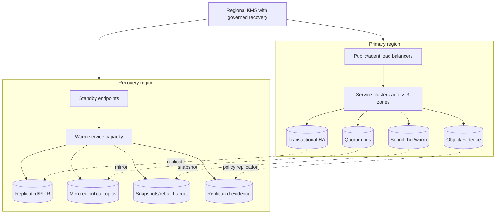

# System Architecture and Engineering Diagrams

## Endpoint network telemetry vertical

Windows kernel TCP/IP ETW or Linux Falco syscall JSON → evidence-preserving `network-event.v1` normalization → bounded crash-safe queue → gzip over endpoint-bound mTLS → gateway validation → PostgreSQL authority and transactional outbox → explicit-ACK NATS JetStream → versioned OpenSearch index/atomic alias → tenant-bound APIs, UI, and MinIO export. Collector-partition failures are isolated. Packets, payloads, DNS, URLs, TLS/HTTP content, detection, and response are outside this path.

## Trustworthy Windows Registry telemetry vertical

The elevated Windows agent consumes `Microsoft-Windows-Kernel-Registry` through the established owned ETW session model, preserves native callback semantics and resolution quality, and sends canonical registry observations through the shared crash-safe queue, gzip batch, and endpoint-bound mTLS channel. The gateway assigns tenant and server timestamps, validates source/schema/limits/policy, and commits event/entity/history plus `registry.changed` outbox state atomically. A durable explicit-ACK JetStream consumer projects into a versioned index behind the atomic `platform-registry-events` alias. Tenant-filtered APIs/UI provide search, detail, histories, endpoint timeline, process relationships, health, policy/exclusions, and policy-preserving MinIO exports.

PostgreSQL is authoritative. Projection rebuild is system-global and requires `system:admin`. Capture is metadata-only by default; hashes and bounded previews require explicit allowed path/type policy, and preview reads require sensitive-data permission. See [ADR 0004](../adr/0004-windows-registry-telemetry.md).

## Trustworthy process telemetry vertical

The enrolled agent normalizes platform collector observations, persists them to a bounded local queue, and sends integrity-protected gzip batches over its existing mTLS identity. The gateway binds certificate subject, active agent, endpoint, installation, and tenant before validation. One PostgreSQL transaction deduplicates events, merges the execution entity, records health/loss state, and creates versioned outbox messages. NATS carries `process.telemetry.v1`; durable idempotent consumers update the `platform-processes` OpenSearch alias. Analyst APIs and UI always apply tenant scope and expose provenance and missing-data states. See ADR 0003 for collector limitations.

## Context and component view

## Module dependency graph

## Agent enrollment and telemetry sequence

## Detection to governed response

## Plugin installation

## Repository dependency view

## Enterprise deployment

