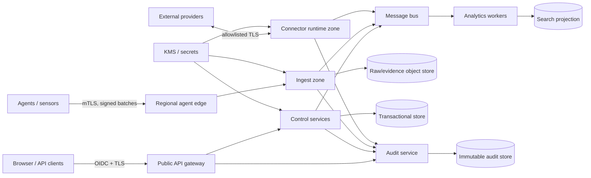

# Infrastructure, Deployment and Reliability Blueprint

## Logical data services

Phase 1 locks capabilities, not proprietary backend products. Provider selection is an implementation ADR; the following stable roles are mandatory.

| Role | Data and requirement | HA/scale | Backup/DR |
|---|---|---|---|
| Transactional database | Tenants, identities, policies, cases, jobs, plugin state; strict tenant keys and optimistic concurrency | Multi-AZ primary/replicas; partition largest tables by tenant/time | PITR, encrypted full backup, daily restore test sample |
| Search/analytics | Canonical telemetry, findings and timeline projections | Shards routed by tenant/time; hot/warm/cold; workload admission | Rebuild from raw where possible; snapshots for RTO |
| Object/evidence storage | Raw payloads, artifacts, evidence, reports, packages | Erasure/region durability; immutable/WORM and legal holds | Cross-region copy by policy; manifest verification |
| Message bus | Domain events and durable work; at-least-once | Quorum across zones; partition by tenant/entity key | Mirrored critical topics; replay retention and DLQ |
| Cache | Sessions, authz decisions, capabilities and safe query results | Clustered, disposable; strict tenant-prefixed keys | No authoritative data; cold-start tested |
| Graph projection | Entity/incident traversal, rebuildable from events | Partitioned tenant graph; bounded query admission | Snapshot plus deterministic rebuild |
| Secrets/KMS | Envelope keys, signing, connector secrets | HSM/KMS quorum and regional keys; least privilege | Documented escrow/BYOK recovery; rotation drills |
| Configuration registry | Versioned runtime flags and service config | Replicated/read cached | Git/audit backed; no secrets |
| Observability | Metrics/logs/traces/SLOs, logically separate from product data | Independent regional collectors | Operational retention and export; privacy-redacted |

## Deployment profiles

| Profile | Shape | Guarantee |
|---|---|---|
| Developer | Single workstation/container composition with synthetic data | Same APIs/schemas, no HA claim |
| Evaluation | Single-node or small cluster, bounded endpoint count | Upgrade/backup supported; reduced SLO |
| Enterprise | Kubernetes-orchestrated multi-zone services and managed/external data dependencies | Published availability, rolling upgrades, tested DR |
| Sovereign/on-prem | Customer-operated cluster with local dependencies | No mandatory vendor data egress; support bundle is redacted/approved |
| Air-gapped | Offline registry/catalog/update mirror and local identity/keys | Signed import/export, revocation and time-drift procedures; functional parity target |

## Availability and scaling

- Stateless services scale on concurrency/latency; ingestion on bytes/events and queue lag; workers on partition lag; search on query pressure; stores on capacity/IOPS.
- Tenant workload isolation uses per-tenant quotas, priority queues, search admission and circuit breakers. One tenant cannot exhaust shared pools.
- Regional edge accepts agent data and jobs locally. Control-plane ownership of a tenant has one write region in v1.0; cross-region active/active writes are deferred.
- Readiness means capable of serving correct traffic, not merely process alive. Dependency failure is exposed without causing restart storms.
- Load shedding preserves agent health/gap/custody/audit events before low-value verbose telemetry.

Initial service objectives: control API 99.9% monthly; agent ingest receipt 99.95%; audit/evidence integrity 100%; p95 interactive inventory <2s, timeline first page <5s, action dispatch to online agent <10s, excluding provider/endpoint execution. ADRs may refine targets with measured cost.

## Security zones and communication

Service-to-service communication uses workload identity, mTLS, explicit authorization and short deadlines. Public, agent, connector, data and management planes are separate network zones. Databases are never public. Administrative break-glass access is time-limited, approved, recorded and independently alerted.

## Backup and disaster recovery

| Class | Target RPO/RTO | Procedure |
|---|---|---|
| Tenant/control/job state | ≤5 min / ≤4 h | PITR + transaction-log replication; reconcile outbox and idempotency ledger |
| Audit/custody | 0 acknowledged loss / ≤4 h | synchronous durable append or fail closed for high-risk mutation |
| Raw evidence | 0 after verified receipt / ≤8 h | durable object replication and manifest scan |
| Search/timeline/graph | ≤1 h / ≤24 h | snapshot then replay raw/domain events |
| Packages/config | 0 / ≤4 h | signed immutable registry and replicated configuration history |

Quarterly exercises restore an isolated environment, verify hashes and authorization, replay queues, rotate endpoints, and document measured RPO/RTO. Backup success without restore verification is not accepted.

## Air-gap lifecycle

An online staging station downloads a signed release bill of materials, packages, schemas, content, vulnerability/intelligence snapshots and revocation list. A separate verifier checks signatures, freshness and policy, then writes a tamper-evident transfer bundle. The offline environment re-verifies using pinned roots, previews migrations, installs through canary rings and emits a signed receipt that may be exported. Outbound evidence uses recipient encryption, classification approval, manifest and custody records. No cloud license heartbeat is required for core protection during the licensed offline period.

